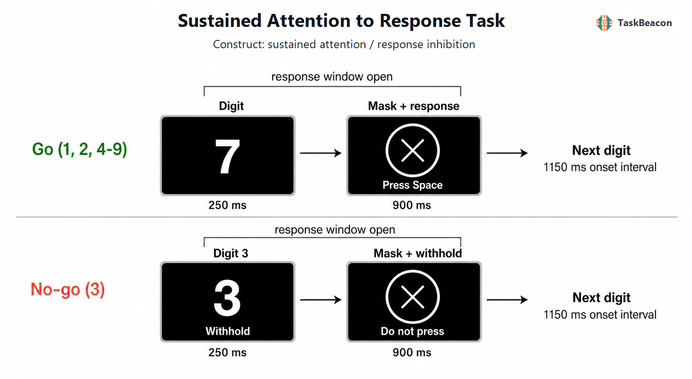

# Sustained Attention to Response Task

| Field | Value |
|---|---|
| Name | Sustained Attention to Response Task |
| Task ID | `T000064` |
| Variant | Original fixed SART |
| Version | `v0.1.0` |
| Date Updated | 2026-07-12 |
| PsyFlow Version | `0.2.0` |
| PsychoPy Version | `2025.1.1` |
| Modality | Behavioral |
| Language | Chinese instructions; numeric stimuli |

## 1. Task Overview

Participants press Space for digits 1, 2, and 4-9, but withhold for digit 3. Frequent fixed-rate responding creates the prepotent response stream used to measure sustained-attention lapses and response inhibition.

## 2. Task Flow

### Block-Level Flow

An 18-trial practice block precedes one continuous 225-trial scored block. Each digit appears 25 times in the scored block.

### Trial-Level Flow

| Phase | Duration | Event |
|---|---:|---|
| Digit | 250 ms | White digit in one of five sizes |
| Mask/response | 900 ms | 29 mm encircled X; response remains available |

### Controller Logic

The task is nonadaptive. A seeded plan enforces digit and size counts; PsyFlow owns timing and response capture.

## 3. Configuration Summary

### a. Subject Info
Three-digit participant ID; Space is the only response key.

### b. Window Settings
Visual-degree units, black background, and 50 cm viewing distance.

### c. Stimuli
Digits use the original five point sizes mapped to 12-29 mm heights. The mask is a 29 mm white ring with a diagonal cross.

### d. Timing
Digits appear for 250 ms and masks for 900 ms, giving a fixed 1150 ms onset interval.

## 4. Methods (for academic publication)

Participants completed the fixed Sustained Attention to Response Task. Digits 1-9 were presented centrally in white on black for 250 ms, followed immediately by a 900 ms encircled-X mask. Responses were accepted throughout both phases. Participants pressed Space for every digit except 3, for which they withheld. After 18 practice trials, 225 scored trials presented each digit 25 times. Digit size varied among 48, 72, 94, 100, and 120 points. Primary outcomes were commission errors on digit 3, omission errors on go digits, and correct go RT variability.

## Reference

Robertson, I. H., Manly, T., Andrade, J., Baddeley, B. T., & Yiend, J. (1997). 'Oops!': Performance correlates of everyday attentional failures in traumatic brain injured and normal subjects. *Neuropsychologia, 35*(6), 747-758. https://doi.org/10.1016/S0028-3932(97)00015-8
